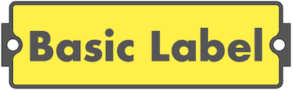
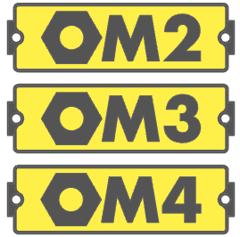
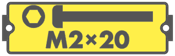
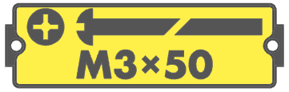
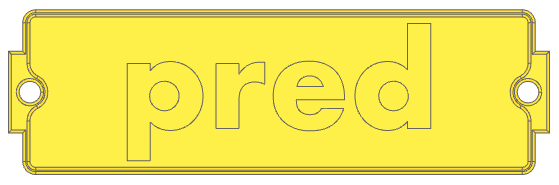
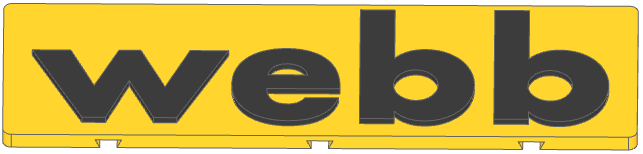
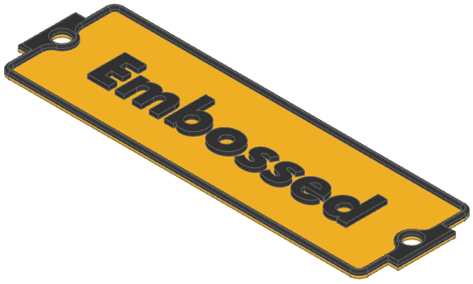
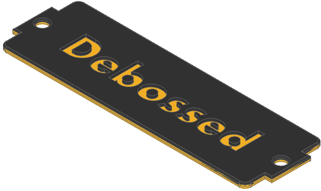
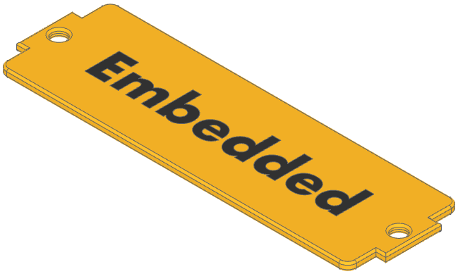

# GFLabel

Generates labels for labelled [gridfinity][gridfinity] bins (primarily
[pred][pred] and [Cullen J Webb][webb] labels), and similar
generate-smallish-printable-label uses. Leverages [build123d][build123d].

[gridfinity]: https://gridfinity.xyz/
[pred]: https://www.printables.com/model/592545-gridfinity-bin-with-printable-label-by-pred-parame
[webb]: https://makerworld.com/en/models/446624
[build123d]: https://github.com/gumyr/build123d

## State

This is an early version of a hobby project. Thus:

- It has a lot of rough edges, not the least that the output is messy and
  not very useful. But functionality not used much might not work well.
- It sometimes needs manual encouragement to make labels looking good or
  consistent.
- A habit of sometimes crashing OCP when geometry is a little bit odd.


## Usage

### Installation

You should be able to install into your favorite python-virtual-environment
manager by just using pip:

```
pip install gflabel
```

This should work on most modern platforms, but with the following caveats:

- Linux wheels for the dependency cadquery-ocp are only available on
  resonably modern (e.g. Ubuntu 22.4+) linux distributions, so you may have to
  go to conda to install on an older machine.
- For specifically macOS arm64, the underlying cadquery-ocp library is not
  available as a wheel through pypi. In this case, you will have to set up the
  build123d environment manually. build123d has [some notes][install_build123d]
  on resolving this conflict.

[install_build123d]: https://build123d.readthedocs.io/en/latest/installation.html#special-notes-on-apple-silicon-installs

Otherwise, you can check out this repository and `pip install` it directly, or
install directly from the github repo:

```
pip install git+https://github.com/ndevenish/gflabel.git
```
### VSCode Preview

If you are using VSCode with the [vscode-ocp-cad-viewer][ocp-vscode] extension,
you can add the `--vscode` flag when running `gflabel`, and the label should
show up as a preview. This saves opening the output CAD files in a slicer or
other viewer, and is useful when prototyping labels.

[ocp-vscode]: https://github.com/bernhard-42/vscode-ocp-cad-viewer

### Basic Examples

By default, labels are written to an output file "`label.step`". You can change
this with `-o FILENAME`. `.step`, `.stl` and `.svg` are recognised

A simple, single label generation on a pred-style base:

```
gflabel "Basic Label" -o basic.step
```



Symbols are specified with `{` curly braces `}`. If you specify more labels
than divisions (which defaults to one), then multiple labels will be generated
with a single call:

```
gflabel "{nut}M2" "{nut}M3" "{nut}M4"
```



Or, if you specify divisions, then you can generate a multi-bin label (in this
example, a margin is also added to ensure that the labels are not too dense):
```
gflabel --width 2 --divisions=3 "{nut}M2" "{nut}M3" "{nut}M4" --vscode --margin=2
```


You can span multiple lines, mix text and symbols, and some symbols can be
passed configuration (e.g. in this case the bolt length is dynamically
specified as  20mm):
```
gflabel "{head(hex)} {bolt(20)}\nM2×20"
```


Some symbols can also take many modifiers for e.g. drive or head type:

```
gflabel "{head(+)} {bolt(50,slotted,round)}\nM3×50"
```


And multiple label styles/symbol styles/fonts can be selected:
```
gflabel --base=webb --font=Arial "M3×20{...}{webbolt(+)}"
```


Here's a more complex example, generating a [Pred Gridfinity Storage Box][predbox]
label. This uses multiple proportioned columns, symbols, and alignment:

```
gflabel --base=predbox -w 5 "HEX\n{head(hex)} {bolt(5)}{3|}{<}M2\nM3\nM4\nM5{2|2}{<}M6\nM8\nM10\n"
```


## Command Parameters

The full command parameter usage (as generate by `gflabel --help`):

```
usage: gflabel [-h] [--base {pred,plain,none,webb,predbox}] [--vscode] [-w WIDTH]
               [--height HEIGHT] [--depth DEPTH_MM] [--no-overheight] [-d DIVISIONS]
               [--font FONT]
               [--font-size-maximum FONT_SIZE_MAXIMUM | --font-size FONT_SIZE]
               [--font-style {regular,bold,italic}] [--margin MARGIN]
               [-o [OUTPUT ...]] [--style {embossed,debossed,embedded}]
               [--list-fragments] [--list-symbols] [--label-gap LABEL_GAP]
               [--column-gap COLUMN_GAP] [-v]
               LABEL [LABEL ...]

Generate gridfinity bin labels

positional arguments:
  LABEL

options:
  -h, --help            show this help message and exit
  --base {pred,plain,none,webb,predbox}
                        Label base to generate onto. [Default: pred]
  --vscode              Run in vscode_ocp mode, and show the label afterwards.
  -w WIDTH, --width WIDTH
                        Label width. If using a gridfinity standard base, then this is
                        width in U. Otherwise, width in mm.
  --height HEIGHT       Label height, in mm. Ignored for standardised label bases.
  --depth DEPTH_MM      How high (or deep) the label extrusion is.
  --no-overheight       Disable the 'Overheight' system. This allows some symbols to
                        oversize, meaning that the rest of the line will first shrink
                        before they are shrunk.
  -d DIVISIONS, --divisions DIVISIONS
                        How many areas to divide a single label into. If more labels
                        that this are requested, multiple labels will be generated.
                        Default: 1.
  --font FONT           The font to use for rendering. [Default: Futura]
  --font-size-maximum FONT_SIZE_MAXIMUM
                        Specify a maximum font size (in mm) to use for rendering. The
                        text may end up smaller than this if it needs to fit in the
                        area.
  --font-size FONT_SIZE
                        The font size (in mm) to use for rendering. If unset, then the
                        font will use as much vertical space as needed (that also fits
                        within the horizontal area).
  --font-style {regular,bold,italic}
                        The font style use for rendering. [Default: regular]
  --margin MARGIN       The margin area (in mm) to leave around the label contents.
                        Default is per-base.
  -o [OUTPUT ...], --output [OUTPUT ...]
                        Output filename(s). [Default: ['label.step']]
  --style {embossed,debossed,embedded}
                        How the label contents are formed.
  --list-fragments      List all available fragments.
  --list-symbols        List all available electronic symbols
  --label-gap LABEL_GAP
                        Vertical gap (in mm) between physical labels. Default: 2 mm
  --column-gap COLUMN_GAP
                        Gap (in mm) between columns
  -v, --verbose         Verbose output
```

## Defining Labels

Labels can consist of:

- A physical base, which is the object that the labels are extruded out of
  (or cut into).
- A label style, which specifies whether the label is raised out of, cut into,
  or flush with the surface of the base.
- Regular text, including unicode symbols (although complex symbols like emoji
  are unlikely to render properly, or at all - this is down to the underlying
  library).
- Newlines, either explicitly typed in (e.g. at the terminal), or escaped by
  writing `\n` in the label definition. Each line will be rendered separately,
  but still constrained to the same label area.
- Fragments. These are directives enclosed in `{`curly`}` braces that add
  symbols or define an area on the label.

Let's go through each of these:

### Label Bases

The base (specified by `--base=TYPE`) defines the shape of what the label is generated on top of. Currently, the following bases are understood:

| Base | Description | Image |
| ---- | ----------- | ----- |
| `pred` | For [Pred's parametric labelled bins][predlabel] labels. If specifying this style, then height is ignored and width is in gridfinity units (e.g. `--width=1` for a label for a single 42mm bin). |  |
| `predbox` | For labels matching the style of [Pred's Parametric Storage Box][predbox]. These are larger (~25 mm) labels for slotting in the front of the parametric storage boxes. `--width` is for the storage bin width, and is 4, 5, 6, or 7 u. | 
| `plain` | For a blank, square label with a chamfered top edge. The specified width and height will be the whole area of the label base. You must specify at least a width. | 
| `webb` | For [Cullen J Webb's ](https://makerworld.com/en/models/446624) swappable label system. Label is a 36.4 mm x 11 mm rounded rectangle with snap-fit inserts on the back. Use without margins to match the author's style labels. | 
| `none` | For no base at all - the label will still be extruded. This is useful if you want to generate a label model to place onto another volume in the slicer. |  |

[predlabel]: https://www.printables.com/model/592545-gridfinity-bin-with-printable-label-by-pred-parame
[predbox]: https://www.printables.com/model/543553-gridfinity-storage-box-by-pred-now-parametric

### Label Styles

Label style controls whether the generated label is raised out of, cut into, or
flush with the base surface. This is controlled with the `--style=` parameter,
which can be set to `embossed`, `debossed`, or `embedded`:

| Style    | Description | Image      |
| -------- | ----------- | --------- |
| Embossed | This is the default. The labels contents are extruded upwards out of the base, as raised features. You can print this multicoloured by changing material at a specific layer height. | 
| Debossed | Instead of being raised, the label contents are cut into the base. You can also print this multicoloured by changing material at specific layer height.  | 
| Embedded | The label contents are flush with the surface of the label. This can be printed with a multimaterial system, as it will require material changes within a single layer. You can print this label face-down. To print this, you will need to "Split to Parts" (Bambu/OrcaSlicer) in your slicer and manually change the selected material for the bases.  | 


### Symbols/Fragments

Along with text, you can add symbols and features to a label by specifying
"fragments". These are directives enclosed in `{`curly braces`}`.

A list of all the fragments currently recognised:

| Names             | Description                                                       |
|-------------------|-------------------------------------------------------------------|
| ...               | Blank area that always expands to fill available space.<br><br>If specified multiple times, the areas will be balanced between<br>entries. This can be used to justify/align text. |
| &lt;, &gt;        | Only used at the start of a single label or column. Specifies that all lines in the area should be left or right aligned. Invalid when specified elsewhere. |
| &lt;number&gt;    | A gap of specific width, in mm.                                   |
| bolt              | Variable length bolt, in the style of Printables pred-box labels.<br><br>If the requested bolt is longer than the available space, then the<br>bolt will be as large as possible with a broken thread. |
| box               | Arbitrary width, height centered box. If height is not specified, will expand to row height. |
| head              | Screw head with specifiable head-shape.                           |
| hexhead           | Hexagonal screw head. Will accept drives, but not compulsory.     |
| hexnut, nut       | Hexagonal outer profile nut with circular cutout.                 |
| lockwasher        | Circular washer with a locking cutout.                            |
| measure           | Fills as much area as possible with a dimension line, and shows the length. Useful for debugging.|
| sym, symbol       | Render an electronic symbol.                                      |
| threaded_insert   | Representation of a threaded insert.                              |
| variable_resistor | Electrical symbol of a variable resistor.                         |
| washer            | Circular washer with a circular hole.                             |
| webbolt           | Alternate bolt representation incorporating screw drive, with fixed length. |
| `\|` (pipe)         | Denotes a column edge, where the label should be split. You can specify relative proportions for the columns, as well as specifying the column alignment. |

A basic set of examples showing the usage of some of these:


### Bolt/Screw Drives

The `{head(...)}` fragment, and any other fragments that will accept drive
head types, takes a feature specification for the kind of drive that you want
to represent. These are stackable, so you can specify multiple drives and they
will be overlapped. Examples of using the drive types are:


### Bolts and Screw Heads

There are two classes of bolt/screw representation:

- `bolt` corresponding to the [Pred's printable label bin](https://www.printables.com/model/592545-gridfinity-bin-with-printable-label-by-pred-parame) bolt style. This is
  used simple as `{bolt(LENGTH)}`, where `LENGTH` is the length of the bolt/
  screw stem that you want (excluding the height of the head). If the label
  area is too small to fit the entire bolt on, then the bolt will be rendered
  with a "break" in the middle, indicating that it does not show the whole
  bolt length. It will also accept a `slot` feature that marks a small indent
  on the top of the head, and `flanged` in order to render a washer-style
  flange at the bottom of the active head.
- `webb` corresponding to the bolt style included with [Cullen J Webb's swappable
  gridfinity label](https://makerworld.com/en/models/446624) system. It doesn't
  change length, but it will accept any combination of screw drive specifier
  and display them in the bolt head.

Both types of bolts will accept a head style, one of `pan`, `socket`, `round`,
or `countersunk`. Both can be marked as `tapping` to have a pointed tip, and
both can be pointed backwards by adding the `flipped` feature.

Examples showing some differences between the two bolts:


### Multiple Columns

Although the division system (`--divisions`) can be used to create a single
label with multiple areas (e.g. the intended usage is for labels for a divided
gridfinity bin that has e.g. more bins than gridfinity units), it isn't as
flexible as the column separator fragment, `{|}` (using the pipe symbol).

In the simple case, this just separates the areas mostly the same as if you had
divided the bin, except that column mode has an explicit (and default) column
gap (controled by `--column-gap`). Here's a label split into three with
divisions (left), and columns(right):

```
$ gflabel "A\n{measure}" "B\n{measure}" "C\n{measure}"
$ gflabel "A\n{measure}{|}B\n{measure}{|}C\n{measure}"
```


> [!NOTE]
> `{measure}` fragments have been added to make it easy to see how the layout
> is being affected.

However, with columns you can specify the proportions each column should be in
relation to each other, by specifying the proportion each side of the pipe e.g.
`{2|1}`. If unspecified, then the column is assumed to be proportion 1 compared
to whatever the other side is.

In this example, we've asked for 4:1:2 scaling:

```
$ gflabel "A\n{measure}{4|}B\n{measure}{1|2}C\n{measure}"
```


And here, we're combining the column fragments with the alignment fragment.
Alignment markers can go at the start of any column:

```
gflabel "{<}A\n{measure}{4|}{>}B\n{measure}{1|2}{<}C\n{measure}"
```


### Electronic Symbols

Electronic symbols can be generated using the `{symbol(...)}` fragment.
GFLabel is using the [Chris Pikul Electronic Symbols ][pikul] library kindly
released under MIT Licence.

[pikul]: https://github.com/chris-pikul/electronic-symbols

There are currently three main approaches to selecting the symbol that you
want:

- Exact [ID][ID], or exact [Filename][files], as defined the original source.
- Component name, as listed on the symbol source [README][pikul] (and in the
  table below). In cases where multiple symbols have the same name, they can
  be differentiated by standard e.g. `{symbol(capacitor,iec)}`. If standard is
  not specified, and there are multiple matches, then the first of [`common`,
  `iec`, `ieee`] will be chosen (if doing so makes it unambiguous).
- Fuzzy matching. You can pass in words or parts of words. Symbols with
  category, name or ID that match these (in any order) will be selected. If
  more than one candidate symbols matches, then the table of possible matches
  will be returned so that you can refine it further.

You can list all of the symbols available with `gflabel --list-symbols`.

For an example of this fuzzy matching, the fragment `{symbol(ground)}` isn't
enough to disambiguate between the possible options, so the table of matches
is printed to help you refine the definition:

```
$ gflabel '{symbol(ground)}'
...
Could not decide on symbol from fuzzy specification "ground". Possible options:
    ID                 Category Name                  Standard Filename
    ground-com-signal  GROUND   Digital/Signal Ground COMMON   Ground-COM-Signal
    ground-com-general GROUND   Common/Earth Ground   COMMON   Ground-COM-General
    ground-com-chassis GROUND   Chassis Ground        COMMON   Ground-COM-Chassis

Could not proceed: Please specify symbol more precisely.
```

Given this, you could disambiguate by refining the fuzzy specification e.g.
`{symbol(signal ground)}`, matching the exact name `{symbol(Common/Earth Ground)}`,
or specifying the ID/Filename exactly: `{symbol(Ground-COM-Signal)}`.

[ID]: https://github.com/chris-pikul/electronic-symbols/blob/main/manifest.json
[files]: https://github.com/chris-pikul/electronic-symbols/tree/main/SVG

Here is a table of all symbols, rendered by GFLabel, with their name as per the
source symbol library. Note that for some of the symbols, they are rendered
incorrectly. This is an unresolved bug in GFLabel.

